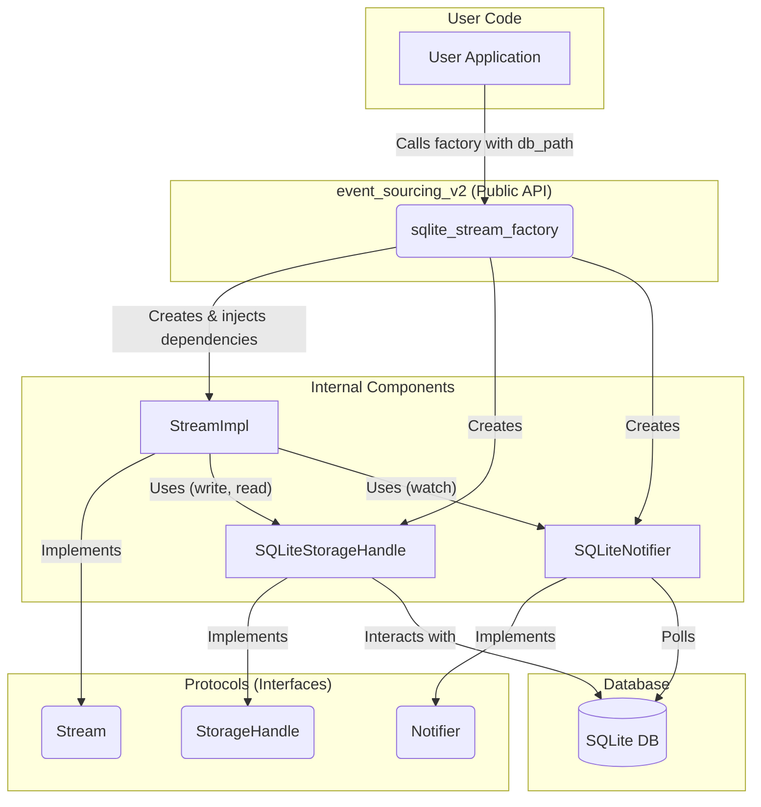

# Design Document: Event Sourcing V2

This document provides a high-level overview of the architecture, components, and design philosophy of the `event-sourcing-v2` library.

## 1. Philosophy

The library is built on a few core principles:

*   **Minimal & Functional**: Provide a small, elegant API that focuses on the core tenets of event sourcing without including non-essential features like a built-in gRPC server or workflow manager.
*   **Async First**: The entire library is built on `asyncio` to ensure high-performance, non-blocking I/O suitable for modern applications.
*   **Extensible by Design**: The core logic is decoupled from the storage implementation. This is achieved by defining clear contracts (`Protocols`) for storage and notification, allowing users to easily swap out the default SQLite backend for any other database.
*   **Robust & Performant**: The default SQLite implementation is heavily optimized for high-concurrency scenarios, using WAL mode, dedicated read/write connections, and sensible `PRAGMA` settings to ensure both safety and speed.

## 2. Architecture Overview

The library follows a layered architecture with a clear separation of concerns between the public API, the core stream logic, the storage protocols, and the concrete storage implementation.

### Flow Description

1.  **Initialization**: The user's application calls the `sqlite_stream_factory` with a database path. This factory is an `asynccontextmanager` that manages the entire lifecycle of the required resources.
2.  **Dependency Creation**: The factory creates instances of the `SQLiteStorageHandle` (for reads/writes) and the `SQLiteNotifier` (for watching).
3.  **Stream Instantiation**: For each stream the user requests, the factory injects the storage handle and notifier into a `StreamImpl` instance. The user interacts with this `StreamImpl` instance through the `Stream` protocol, ensuring they are not coupled to the implementation details.
4.  **Operations**: When the user calls methods like `write()`, `read()`, or `watch()` on the stream, `StreamImpl` delegates these calls to the appropriate backend component (`SQLiteStorageHandle` or `SQLiteNotifier`), which then interacts with the SQLite database.

## 3. Component Deep Dive

### `sqlite_stream_factory`

*   **Role**: Public entry point for creating SQLite-backed event streams.
*   **Responsibility**:
    *   Manages database connection lifecycles (write, read pool, notifier).
    *   Initializes the database schema.
    *   Instantiates and wires together `SQLiteStorageHandle`, `SQLiteNotifier`, and `StreamImpl`.
    *   Provides a simple factory function, abstracting away implementation details.

### `StreamImpl`

*   **Role**: Core implementation of the `Stream` protocol; orchestrates business logic.
*   **Responsibility**:
    *   Maintains in-memory stream state (`stream_id`, `version`).
    *   Handles optimistic concurrency checks.
    *   Delegates persistence to the injected `StorageHandle`.
    *   Delegates `watch` operations to the injected `Notifier`.
    *   Agnostic of the underlying storage mechanism.

### `SQLiteStorageHandle`

*   **Role**: SQLite implementation of the `StorageHandle` protocol.
*   **Responsibility**:
    *   Executes low-level SQL operations (INSERT, SELECT) for events and snapshots.
    *   Manages transactions (`SAVEPOINT`) for atomic writes.
    *   Implements idempotency checks.
    *   Contains all SQLite-specific SQL queries and logic.

### `SQLiteNotifier`

*   **Role**: SQLite implementation of the `Notifier` protocol.
*   **Responsibility**:
    *   Runs a background task to poll the `events` table.
    *   Manages active watchers (subscribers).
    *   Notifies watchers of new events.
    *   Handles replay of historical events for new watchers.

## 4. Extensibility Guide

The library is designed to be extended with different storage backends. To create a new adapter (e.g., for PostgreSQL), you would need to do the following:

1.  **Implement `StorageHandle`**: Create a class that implements the `StorageHandle` protocol defined in `protocols.py`. This class would contain all the database-specific logic for writing, reading, and managing snapshots for your chosen database.
2.  **Implement `Notifier`**: Create a class that implements the `Notifier` protocol. The implementation will depend on the capabilities of your database. For PostgreSQL, you could use the `LISTEN`/`NOTIFY` feature for a highly efficient, push-based implementation instead of polling.
3.  **Create a Factory Function**: Write your own factory function (e.g., `postgres_stream_factory`) that mirrors the role of `sqlite_stream_factory`. It would be responsible for managing connections to your database and injecting your new `PostgresStorageHandle` and `PostgresNotifier` into the `StreamImpl`.

By adhering to these protocols, your new storage adapter will seamlessly integrate with the core `StreamImpl` logic without requiring any changes to it.
