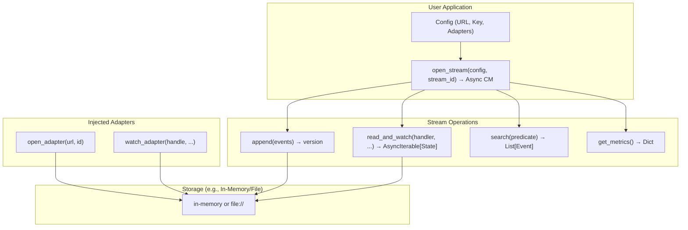

# Python Event Sourcing Design Document

## Overview

This library provides a minimal, functional event sourcing system focused on personal encrypted streams as the single source of truth (SSOT) for user data (e.g., life events like insurance claims or subscriptions). Streams are immutable logs of events, with default encryption controlled by user-provided keys. The design emphasizes simplicity, familiarity (mirroring async file/HTTP I/O paradigms), and elegance: pure functions via factories, dependency injection (DI) for configs/adapters, async context managers for lifecycle, and no more than 200 lines per file.

Key exclusions: No servers, workflows, or distributed features—these can build on this core. Storage is adapter-based (injected via config), defaulting to in-memory with optional file backing. Optional knowledge graph (KG) as an extension (not core).

## Goals and Principles

- **SSOT for Users:** Each stream (per user ID) holds an immutable, versioned log of events as the authoritative truth.
- **Encryption by Default:** Event data encrypted with user-chosen keys; metadata unencrypted for search.
- **Familiar API:** Mirror async I/O (e.g., open/read/write/watch like aiofiles).
- **Minimal & Functional:** Factory pattern for creation, DI for configs/adapters, Pydantic for external data (Event), dataclasses internal. Async for all I/O. Files <200 lines.
- **Efficiency for Scale:** Lazy loading, optional caching, adapters for protocols (primarily in-memory/file). No global state—per-stream context managers.
- **Observability:** Simple metrics (version, count) without plugins.
- **Extensibility:** Adapters/hooks for custom storage/watching; optional KG builder.
- **TDD:** All features tested with isolation (fresh stream per test).

## Architecture



- **Factory Layer:** Creates per-stream async context managers with injected config.
- **Operations Layer:** Functional async methods on Stream (internal object).
- **Adapters:** User-injected pure functions for protocols; core routes to them.
- **Encryption:** Integrated into append/read (uses cryptography lib, injected key).

## API Details

### Factory: open_stream
Creates an async context manager for a specific stream. URL is required and explicit.

```python
from typing import AsyncContextManager, Dict

def open_stream(config: Dict, stream_id: str) -> AsyncContextManager["Stream"]:
    pass  # Returns CM; on enter: connects via open_adapter; on exit: cleans up
```

Example Config:
```python
config = {
    "url": "file:///local/streams/user-123.jsonl",  # Optional; temp file if omitted
    "key": b"mysecret",  # Encryption key
    "open_adapter": file_open_adapter,  # Optional
    "watch_adapter": file_watch_adapter,  # Optional
    "cache_size": 50,  # Optional
}
```

### Models
Pydantic for external validation.

```python
from pydantic import BaseModel
from datetime import datetime
from typing import Dict, Any

class Event(BaseModel):
    type: str
    data: bytes  # Encrypted payload
    timestamp: datetime
    metadata: Dict[str, Any]  # Unencrypted for filtering/search
```

### Stream Operations
Accessed via the CM (Stream is internal dataclass).

```python
from typing import Any, AsyncIterable, Callable, Dict, List
from .models import Event

# Internal Stream (dataclass, not exposed)
async def append(self, events: List[Event], expected_version: int = -1) -> int:
    pass  # Encrypts data, appends via adapter, returns new version

async def read_and_watch(
    self,
    handler: Callable[[Any, Event], Any],
    initial_state: Any = None,
    filters: Dict = {},
    replay_from: int = 0,
) -> AsyncIterable[Any]:
    pass  # Yields handler(state, event) for historical then live

async def search(self, predicate: Callable[[Event], bool]) -> List[Event]:
    pass  # Decrypts and applies predicate

async def get_metrics(self) -> Dict[str, Any]:
    return {
        "current_version": 11,
        "event_count": 11,
        "last_timestamp": datetime.now(),
        "filename": "/local/streams/user-123.jsonl"  # If file-based
    }
```

Example Usage:
```python
async with open_stream(config, "user-123") as stream:
    await stream.append([Event(type="Update", data=b"data")])
    
    async def handler(state: int, event: Event) -> int:
        return state + 1  # Simple count
    
    async for count in stream.read_and_watch(handler, initial_state=0, replay_from=5):
        print(count)  # Yields counts for v5-current, then live
    
    metrics = await stream.get_metrics()
    print(metrics["current_version"])
    
    found = await stream.search(lambda e: "subscription" in e.data.decode())
```

## Adapters
Injected functions for protocols. Core defaults to in-memory if none provided; parses URL for file:// if specified.

Example File Adapter:
```python
from typing import AsyncContextManager

async def file_open_adapter(url: str, stream_id: str) -> AsyncContextManager:
    pass  # Returns aiofiles.open(f"{url}/{stream_id}.jsonl", "a+")

async def file_watch_adapter(handle, handler: Callable, from_version: int) -> AsyncIterable[Event]:
    pass  # Yields new events via watchfiles or polling
```

Example Custom Adapter (HTTP, out of scope but shown for extensibility):
```python
async def http_open_adapter(url: str, stream_id: str) -> AsyncContextManager:
    pass  # Uses aiohttp.ClientSession() with GET/POST to f"{url}/{stream_id}"
```

## Encryption
- Append: Encrypts Event.data using config["key"] (AES-256 via cryptography).
- Read/Search: Decrypts with key; fails otherwise.

## Testing Requirements
TDD: Agree on these ~15 tests first. Each uses fresh config/stream, isolation via new IDs. Use pytest-asyncio, mocks for adapters. All tests on in-memory streams by default, with optional file backing for persistence tests.

1. Open/Close: Open stream, assert adapter called; exit CM, assert cleanup.
2. Append Basic: Append event, assert encrypted in adapter, version increments.
3. Append Idempotent: Append same twice, second ignored.
4. Append Versioned: Fail on wrong expected_version.
5. Read_and_Watch Full: Replay all + live append → yields all via handler.
6. Read_and_Watch Replay_From: From mid-version + live → yields partial + new.
7. Read_and_Watch Gap Handling: Append during historical yield → yields it.
8. Search Predicate: Applies lambda post-decrypt, returns matches.
9. Metrics Basic: Returns current_version etc.; updates post-append.
10. File Adapter E2E: Open file://, append/read_and_watch works on disk (persistence check).
11. In-Memory E2E: Append/read_and_watch in-memory, assert no persistence.
12. Encryption Modes: Append/read decrypts correctly for one-to-one/many/all.
13. Encryption Failure: Read with wrong key fails decryption.
14. Cache Efficiency: With cache_size=2, open 3 streams → evicts oldest on close.
15. Concurrent Ops: asyncio.gather append/read_and_watch on multiple streams—no races.

## Future Extensions
- Optional KG: build_kg(events, extractor) → networkx Graph.
- Advanced Adapters: For s3://, db://, http:// (user-provided).
- Metrics Expansion: Add more keys if needed (e.g., average event size).

This design is concise, functional, and aligned with rules. Agree? If yes, we'll implement and commit.
